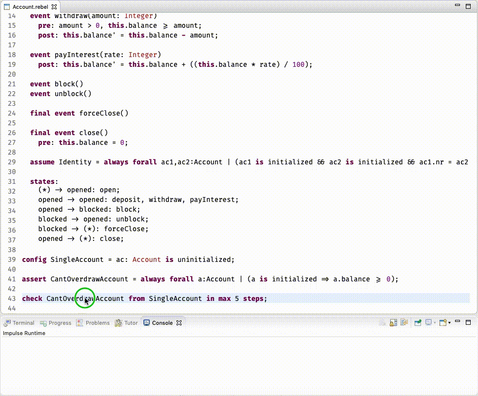
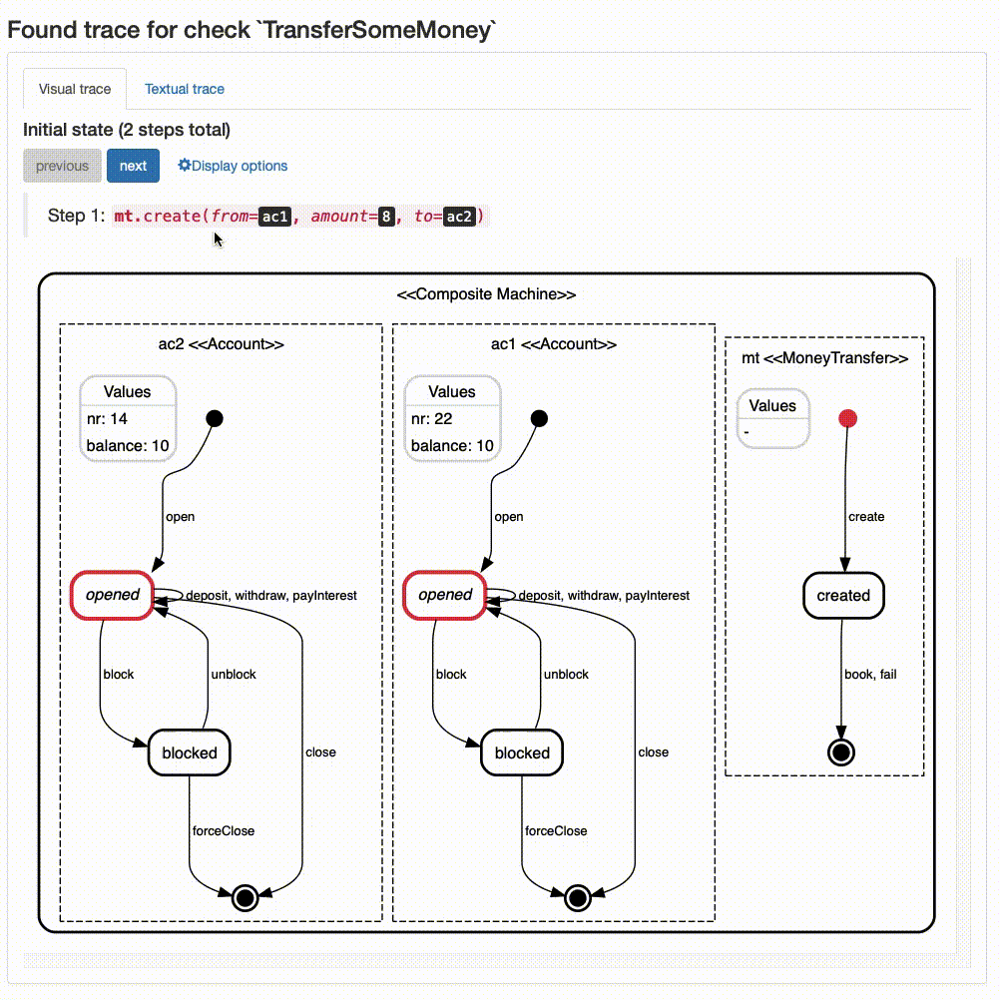
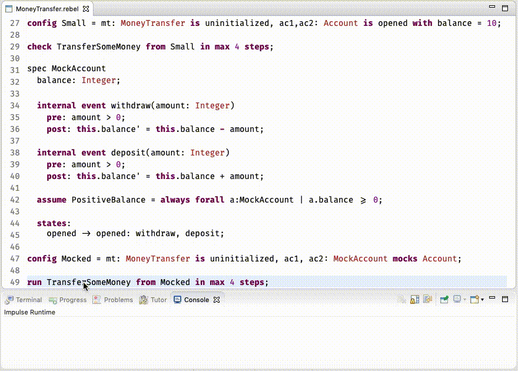

# Rebel<sup>2</sup>: Lightweight Specifications for Enterprise Systems

### Quick jump:
- [Introduction](#introduction)
- [Rebel<sup>2</sup> by Example](#rebel2-by-example)
- [Setting up Rebel<sup>2</sup>](#setting-up-rebel2)

## Introduction

Rebel<sup>2</sup> is a specification language based on communicating State Machines with data. It is a general purpose specification language meaning that it can be used for all kinds of different problems. It offers built-in support for verification of user defined properties using bounded model checking. 

It is inspired by other _lightweight formal methods_ such as [Alloy](https://alloytools.org) and [Electrum](https://github.com/haslab/Electrum2). Just like these formalisms Rebel<sup>2</sup> favors _partiality_ over _completeness_. This results in a language in which it isn't necessary to fully specify a problem before interesting properties can be checked or simulated. It allows for incremental development of specifications. During these increments the user can use the model checker any time to quickly test hypotheses made about the specifications under development. 

What is unique about Rebel<sup>2</sup> is that is offers simple mechanisms to check properties in isolation. This is done by allowing the user to _mock_ specifications without altering the original specification. This construct allows the user to write specifications for a complete problem while still retaining the ability to check non-trivial properties, all with the push of a button!

## Rebel<sup>2</sup> by Example
Enough talk, lets just start with a small example. Lets say that we want to specify a simple bank account and the transfer of money between accounts. The rules are as follows: 
- An account can be opened and closed.
- Every account is uniquely identified.
- Once the account is opened money can be withdrawn or deposited. 
- An account can not be overdrawn. 
- If necessary the account can be blocked for withdrawals and deposits (e.g. when fraud is suspected) and it can be unblocked as well. 
- An account accumulates interest.

### The `Account` specification

Here is the Rebel<sup>2</sup> specification of such an `Account`:
```
spec Account
  nr: Integer,  
  balance: Integer; 
   
  init event open(nr: Integer)
    post: this.nr' = nr, this.balance' = 0;
    
  event deposit(amount: Integer)
    pre: amount > 0;
    post: this.balance' = this.balance + amount;
    
  event withdraw(amount: Integer)
    pre: amount > 0, this.balance >= amount;
    post: this.balance' = this.balance - amount;
    
  event payInterest(rate: Integer)
    post: this.balance' = this.balance + ((this.balance * rate) / 100);
    
  event block()
  event unblock()  

  final event forceClose()
    
  final event close() 
    pre: this.balance = 0; 
  
  assume Identity = always forall ac1,ac2: Account | 
    (ac1 is initialized && ac2 is initialized && ac1.nr = ac2.nr => ac1 = ac2)

  states: 
    (*) -> opened: open;
    opened -> opened: deposit, withdraw, payInterest;
    opened -> blocked: block;
    blocked -> opened: unblock;
    blocked -> (*): forceClose;   
    opened -> (*): close;
```

Specifications contain four different parts: 
1. **Fields:** The first part defines the fields which are local to the state machine. In this case these are the `nr` and `balance` fields. In this example these fields are of the built-in type `Integer`. Rebel<sup>2</sup> has two built-in types: `Integer`'s and `String`'s. Next to that, every `spec` is its own type and can be used but that will become clear later on in this example.
2. **Events:** The second part contains the `event` definitions. These describe which event that can be triggered on the machine. Every event is guarded by a _precondition_ and its effects are described via a _postcondition_. Fields are referenced with the use of the keyword `this`. By priming a field in the postcondition, e.g. `this.balance'` constraints can be formulated for the value of the field in the _next_ state. 
Please note that the `open` event is qualified with the keyword `init` and the `close` and `forceClose` events are qualified with the keyword `final`. The reason for this will be explained shortly.
3. **Assumptions:** The third part contains the `assumptions`, i.e. invariants. These are properties on _traces_ that are assumed to always hold. You can think of a trace as an ordered sequence of events that led to a certain global state. 
In our example the assumption `Identity` states that every account, when initialized, must have its unique `nr` value. Assumptions are formulated using [Linear Temporal Logic (LTL)](https://en.wikipedia.org/wiki/Linear_temporal_logic) operators (`always`, `eventually`, `next` and `until`) combined with other First Order Logic operators (such as `forall`, `exists`, etc.). 
4. **Life cycle:** The last part contains the life cycle definition of the machine. Each line can be read as follows: _from state_ -> _to state_ : _via events_. For example the line `opened -> opened: deposit, withdraw, payInterest;` means that the `Account` machine has a state `opened` which has a self-loop triggered by the events `deposit`, `withdraw` or `payInterest`. 
The `(*)` token is a bit special. When is is used on the left hand side of the definition it represents `initialization` and when it is used on the right hand side it represents `finalization`. This is also where the event qualifiers `init` and `final` come in to play. Only events marked with `init` can be used to transition from initialization to a machine state and only events marked with `final` can be used to transition from a machine state to finalization. 

We can now visualize our `Account` specification using Rebel<sup>2</sup>'s built-in visualization generator. This automatically generates a [UML Statechart Diagram](https://en.wikipedia.org/wiki/State_diagram#Harel_statechart) of the specification of interest. In this case it looks like this:


### Checking a property
Now that we have our Account specified we can start formulating properties we are interested in. For instance, in this case we could wonder whether an `Account` can indeed not be overdrawn. For this we can use an `Assert`:
```
assert CantOverdrawAccount = always forall ac:Account | (ac is initialized => ac.balance >= 0);
```
This assertion states that when an `Account` is initialized (read: not in a initialization or finalization state) it must always be the case that its balance is positive. Just like `assume`, `assert` can be specified using LTL and FOL operators.

As mentioned earlier, Rebel<sup>2</sup> uses bounded model checking to verify whether an assertion holds. So before we can check our assertion we must specify what are the bounds we want to use. We can do this using a `config` statement as follows:
```
config SingleAccount = ac: Account is unitialized;
```
This config statement constructs a so called _initial configuration_ which will be used by the model checker later on. This configuration states that there is only a single instance that will take part, namely the instance `ac` of type `Account`. Next to that is also constraints this instance `ac` to start in an `uninitialized` state. 

Now that we have defined which instances will be part during model checking we still need to define the maximum search depth the model checker is allowed to explore. This search depth represents the number of consecutive events the model checker may raise. We can do this using the following command:
```
check CantOverdrawAccount from SingleAccount in max 5 steps;
```
Let's dissect this statement. The last part, `in max 5 steps`, limits the model checker to never look for traces with more than 5 consecutive raised events. The first part, `check CantOverdrawAccount`, instructs the model checker to check the earlier defined assertion. The `check` command forces the model checker to look for a _counter example_, a trace for which the assertion `CantOverdrawAccount` does not hold. The middle part, `from SingleAccount` states the configuration that should be used by the model checker when searching for a counter example. 

Running this command will yield the following result (click on the line of the command definition, right mouse click and select `Rebel actions -> Run checker (30s timeout)`):



A counter example is found. It seems that we forgot to specify that the interest rate should not be negative. This is why we still end up with an `Account` with a negative balance. Luckily this is easily fixed by adding a precondition to the `payInterest` event like so:
```
event payInterest(rate: Integer)
    pre: rate > 0;
    post: this.balance' = this.balance + ((this.balance * rate) / 100);
```    
Rerunning the same check now yields the desired result. The model checker can not find a counter example anymore.

Btw, although we instructed the model checker to find a counter example within at most five steps, it returned a counter example with only 3 steps. This is by design. The model checker will always return a minimal example. That is, an example with the shortest trace since these are often easier to understand as they only contain the core behavior needed to demonstrate the property.

### Communicating State Machines
Now that we have specified our `Account`, we can focus on the transferal of money between accounts.
We do this by specifying a `MoneyTransfer`:
```
module MoneyTransfer

import Account

spec MoneyTransfer
  from: Account,
  to: Account,
  amount: Integer;

  init event create(from: Account, to: Account, amount: Integer)
    pre: amount > 0, from != to;
    post: this.from' = from, this.to' = to, this.amount' = amount;

  final event book() 
    pre: this.from.withdraw(this.amount), this.to.deposit(this.amount);
  
  final event fail()

  states:
    (*) -> created: create;
    created -> (*): book, fail;
```

Our `MoneyTransfer` specification is very basic. It only describes the necessary interaction needed when transferring money between accounts but it does show how communication occurs within Rebel<sup>2</sup>.

In the initial `create` event the `from` and `to` accounts are set. They are passed in as parameters of the event. Their references are then stored in the `from` and `to` fields of the `MoneyTransfer` state machine. The `book` event describes what happens when the transfer actual occurs. To transfer money we need to `withdraw` it from our `from` account and `deposit` it on our `to` account. 

The syntax for this event synchronization is very similar to method calling in Object Oriented languages. You can just 'call' the event you want to raise on the other machine. The semantics are however a bit different.
In the semantics of Rebel<sup>2</sup> all synchronized events happen as _one atomic step_. This means that either all raised events succeed or they all fail and none of the machines perform a transition. In our example this means that it is impossible to end up in a situation that the money is withdrawn from our account but it isn't deposited. The language simply does not allow this to happen.

### Checking properties on multiple machines
 
Lets see whether this `MoneyTranfer` works as intended by checking whether we can actually transfer money between accounts.
Like before, we have to start by writing down an assertion. In this case we are interested whether the transfer can be booked:
```
assert TransferSomeMoney = eventually exists mt: MoneyTransfer | book on mt
```
This assertion states that at some point the event `book` will be raised on a `MoneyTransfer` instance. 

Next up is a configuration:
```
config Small = t: MoneyTransfer is uninitialized, ac1,ac2: Account is opened with balance = 10;
```
As can be seen for this check we configured an instance of a `MoneyTransfer` as well as two instances of an `Account`.
We configured both accounts to start in the `opened` state with a `balance` of 10.

Lastly, we'll have to write down the command we want to run:
```
run TransferSomeMoney from Small in max 4 steps
```

We are using the `run` command instead of the `check` command. The `run` command instructs the model checker to look for a witness. That is, a trace for which the assertion _does_ hold. You can think of this as a way to perform sanity checks of your specifications: do the specifications allow the desired behavior?

Running this command results in a short trace:


### So what about _mocking_?
So far we have shown a small example of how to specify a simple bank account management system in Rebel<sup>2</sup>. In the real world however, things are often much more complicated. A real account probably has many more attributes like owner, limits, open and close dates, etc. Besides that probably there will be custom specifications for things like `Money`, `Account Number` and many more. In short, the real world is much more complex then we described in our small example.

It is possible to specify all these things in Rebel<sup>2</sup> but there is a catch with regard to the model checker: whenever the specifications become complex (read many fields and/or many events) or the number of instances that are needed to perform a check is high, the model checker probably will need a long time to find a suitable model. This is because the state space the model checker needs to check becomes exponentially larger with each possible event, field or extra instance. This is a well known problem called the [State Space Explosion problem](https://en.wikipedia.org/wiki/Model_checking#Techniques).

Rebel<sup>2</sup> has a simple technique to counter this inherent issue: _mocking_. [Mocking](https://en.wikipedia.org/wiki/Mock_object) is a well known technique in testing. _Mocks_ are entities that mimic the behavior of their real counterpart in a controlled, and often simplified, way. Mocks are often used to test behavior in isolation, disconnected from the rest of the system.
Mocks in Rebel<sup>2</sup> serve a similar purpose: they simplify the behavior of earlier defined specifications with the purpose of being used while model checking a specification that interacts with its original counterpart. Doing this can greatly reduce the search space.

Lets give a small example:
Lets say that our earlier defined `Account` was indeed a real-world, complex specification containing all the necessary details that a real account management system would probably have. If we would have used this real specification in our previous defined `MoneyTransfer` check we would most certainly have run into the state space explosion problem which would result in a model checker that would take a loooooong time to find a witness.<sup>1</sup> 
We can prevent this by defining a mock of the `Account` specification:
```
spec MockAccount
  balance: Integer;
  
  internal event withdraw(amount: Integer)
    pre: amount > 0;
    post: this.balance' = this.balance - amount;
    
  internal event deposit(amount: Integer) 
    pre: amount > 0;
    post: this.balance' = this.balance + amount;
    
  assume PositiveBalance = always forall a:MockAccount | a.balance >= 0;
  
  states:
    opened -> opened: withdraw, deposit;
```
As can be seen this is a "trimmed down" version of our original account. This mocked version only has two events: `withdraw` and `deposit`. Both events have been qualified as `internal`. This means that the model checker can not raise these events separately. They can only be raised when synchronizing with a non-internal event, which is done by the `book` event in `MoneyTransfer` in our example.

Mocked specifications must be _compatible_ with their original counterparts when it comes to synchronization. For instance, the `MoneyTransfer` specification only synchronizes with the `withdraw` and `deposit` events. A compatible `Account` mock specification should therefor contain at least these two events. The event signatures should be _exactly_ the same as their original counterparts, otherwise the whole will not be well-formed.

To use this new `MockAccount` during model checking we'll have to define a new configuration:
```
config Mocked = mt: MoneyTransfer is uninitialized, ac1,ac2: MockedAccount mocks Account;
```
Now we can use this newly created configuration with our `run` command as follows:
```
run TransferSomeMoney from Mocked in max 4 steps;
```
That's it. Running the model checker on this command now again results in a short trace. The difference is that the model checker will now use the `MockAccount` instead of the `Account` specification which results in a shorter time needed to perform the model check:



<sub>1. The model checker of Rebel<sup>2</sup> has a default time-out of 30 seconds. So that wait actually wouldn't be that long :)</sub>

## Setting up Rebel<sup>2</sup>

### Prerequisite
- Rebel<sup>2</sup> is written in the [Rascal Meta Programming Language](https://www.rascal-mpl.org) and is integrated with the [Eclipse IDE](https://www.eclipse.org/downloads/packages/release/2020-06/r/eclipse-ide-rcp-and-rap-developers). You can follow the [Getting Started](https://www.rascal-mpl.org/start/) guide on the Rascal MPL website to setup Rascal and Eclipse.
**Beware:** Currently (feb 2021) Rascal *only* works with Java 8. Newer version of Eclipse (post 2020-06) _only_ work with Java 11 and up. To make sure that you can install Rascal please download the [2020-06 Eclipse RCP and RAP developers version](https://www.eclipse.org/downloads/packages/release/2020-06/r/eclipse-ide-rcp-and-rap-developers) and not a newer version and make sure you use a Java _JDK version 8_!
 
- Rebel<sup>2</sup> uses [AlleAlle](https://www.github.com/cwi-swat/allealle) which in turn uses [Microsofts Z3 SMT solver]() to check user defined properties. 
After installing Rascal and Eclipse please download and install [Microsofts Z3](https://www.github.com/microsoft/z3). Make sure that AlleAlle can find your locally installed Z3 instance. 
From the AlleAlle documentation: "You need to add the following option to the eclipse.ini file of your Eclipse installation: `-Dsolver.z3.path=<path to your local Z3 executable>`. The default path that is used if no path is configured is: `/usr/bin/`"

### Installation
Rebel<sup>2</sup> can be installed as Eclipse plugin. After you have installed Rascal and verified that it worked you can install the Rebel<sup>2</sup> plugin:
1. In Eclipse, open the menu `Help` -> `Install New Software...`.
2. In the `Work with` text field fill in `https://update.rascal-mpl.org/libs` and hit enter.
3. From the `Rascal Libraries` dropdown, select `allealle_feature`, `rebel2_feature` and the `salix_feature`.
4. Click the `Next` button on the following confirmation dialogs. 
5. Restart Eclipse.

Rebel<sup>2</sup> is now installed.
Files with the `.rebel` extension will be parsed as Rebel<sup>2</sup> specifications. You do not have to create a special 'Rebel<sup>2</sup>' Eclipse project, you can add specifications to any Eclipse project.

You should add the `Console` to your Eclipse perspective. Rebel<sup>2</sup> will output information to this console. 
To add this console to your perspective do the following:
- Go to `Window` -> `Show View` -> `Other...`
- Select `General` -> `Console` from the list and hit ok.

#### Test your local installation
After installation you can test whether everything works correctly by following these steps:
1. In Eclipse, create a new Project (`File` -> `New` -> `Project`, select `General`, `Project`) and name it as you see fit.
2. Create a new file and save it as `Light.rebel`.
3. Copy the contents of the [Light.rebel](https://raw.githubusercontent.com/cwi-swat/rebel2/master/examples/Light.rebel) example and paste it in your local `Light.rebel` file.
4. After you see the syntax highlighting, click on the `run BulbCanBreak from OneLight in max 4 steps expect trace;` line, click the right mouse button and select `Rebel actions` -> `Run checker (30s timeout)`.
6. You should now see a short trace how the light bulb can break.  