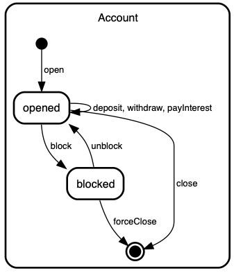

# Rebel<sup>2</sup>: Lightweight Specifications for Enterprise Systems

Rebel<sup>2</sup> is a specification language based on communicating State Machines with data. It is a general purpose specification language meaning that it can be used for all kinds of different domains. It offers built-in support for verification of user defined properties using bounded model checking. 
What is unique about Rebel<sup>2</sup> is that is offers simple mechanisms to check properties in isolation. This is done by allowing the user to _mock_ specifications without altering the original specification. This construct allows the user to write specifications for a complete problem while still retaining the ability to check non-trivial properties, all with the push of a button!

### Quick jump:

- [Rebel<sup>2</sup> by Example](#rebel2-by-example)
- [Setting up Rebel<sup>2</sup>](#setting-up-rebel2)

## Rebel<sup>2</sup> by Example
Enough talk, lets just start with a small example. Lets say that we want to specify a simple bank account and the transferral of money between accounts. The rules are as follows: 
- An account can opened and closed.
- Every account is uniquely identified.
- Once the account is opened money can be withdrawn or deposited. 
- An account can not be overdrawn. 
- If necessary the account can be blocked for withdrawals and deposits (e.g. when fraudulent activity is suspected) and it can be unblocked as well. 
- An account accumulates interest.

### The `Account` specification

Here is the Rebel<sup>2</sup> specification of such an `Account`:
```alloy
module Account

spec Account
  nr: Integer,  
  balance: Integer; 
   
  init event open(nr: Integer)
    post: this.nr' = nr, this.balance' = 0;
    
  event deposit(amount: Integer)
    pre: amount > 0;
    post: this.balance' = this.balance + amount;
    
  event withdraw(amount: Integer)
    pre: amount > 0, this.balance >= amount;
    post: this.balance' = this.balance - amount;
    
  event payInterest(rate: Integer)
    post: this.balance' = this.balance + ((this.balance * rate) / 100);
    
  event block()
  event unblock()  

  final event forceClose()
    
  final event close() 
    pre: this.balance = 0; 
  
  assume Identity = always forall ac1,ac2: Account | 
    (ac1 is initialized && ac2 is initialized && ac1.nr = ac2.nr => ac1 = ac2)

  states: 
    (*) -> opened: open;
    opened -> opened: deposit, withdraw, payInterest;
    opened -> blocked: block;
    blocked -> opened: unblock;
    blocked -> (*): forceClose;   
    opened -> (*): close;
```

Specifications contains four different parts: 
1. The first part defines the fields which are local to the state machine. In this case these are the `nr` and `balance` fields. In this example these fields are of the built-in type `Integer`. Rebel<sup>2</sup> has two built-in types: `Integer`'s and `String`'s. Next to that, every specification is its own type and can be used but that will become clear later on in this example.
2. The second part contains the `event` definitions. These describe which event that can be triggered on the machine. Every event is guarded by a _precondition_ and its effects are described via a _postcondition_. Fields are referenced with the use of the keyword `this`. By priming a field in the postcondition, e.g. `this.balance'` constraints can be formulated for the value of the field in the _next_ state. 
Please note that the `open` event is qualified with the keyword `init` and the `close` and `forceClose` events are qualified with the keyword `final`. The reason for this will be explained shortly.
3. The third part contains the `assumptions`, i.e. invariants. These are properties on _traces_ that are assumed to always hold. You can think of a trace as an ordered sequence of events that led to a certain global state. 
In our example the assumption `Identity` states that every account, when initialized, must have its unique `nr` value. Assumptions are formulated using [Linear Temporal Logic (LTL)](https://en.wikipedia.org/wiki/Linear_temporal_logic) operators (`always`, `eventually`, `next` and `until`) combined with other First Order Logic operators (such as `forall`, `exists`, etc.). 
4. The last part contains the life cycle definition of the machine. Each line can be read as follows: _from state_ -> _to state_ : _via events_. For example the line `opened -> opened: deposit, withdraw, payInterest;` means that the `Account` machine has a state `opened` which has a self-loop triggered by the events `deposit`, `withdraw` or `payInterest`. 
The `(*)` token is a bit special. When is is used on the left hand side of the definition it represents `initialization` and when it is used on the right hand side it represents `finalization`. This is also where the event qualifiers `init` and `final` come in to play. Only events marked with `init` can be used to transition from initialization to a machine state and only events marked with `final` can be used to transition from a machine state to finalization. 

We can now visualize our `Account` specification using Rebel<sup>2</sup>'s built-in visualization generator. This automatically generates a [UML Statechart Diagram](https://en.wikipedia.org/wiki/State_diagram#Harel_statechart) of the specification of interest. In this case it looks like this:


### Checking a property
Now that we have our Account specified we can start formulating properties we are interested in. For instance, in this case we could wonder whether an `Account` can indeed not be overdrawn. For this we can use an `Assert`:
```
assert CantOverdrawAccount = always forall ac:Account | (ac is initialized => ac.balance >= 0);
```
This assertion 

## Setting up Rebel<sup>2</sup>

### Prerequisite
- Rebel<sup>2</sup> is written in the [Rascal Meta Programming Language](https://www.rascal-mpl.org) and is integrated with the [Eclipse IDE](https://www.eclipse.org/downloads/packages/release/2020-06/r/eclipse-ide-rcp-and-rap-developers). You can follow the [Getting Started](https://www.rascal-mpl.org/start/) guide on the Rascal MPL website to setup Rascal and Eclipse.
**Beware:** Currently (feb 2021) Rascal *only* works with Java 8. Newer version of Eclipse (post 2020-06) _only_ work with Java 11 and up. To make sure that you can install Rascal please download the [2020-06 Eclipse RCP and RAP developers version](https://www.eclipse.org/downloads/packages/release/2020-06/r/eclipse-ide-rcp-and-rap-developers) and not a newer version and make sure you use a Java _JDK version 8_!

- Rebel<sup>2</sup> uses [AlleAlle](https://www.github.com/cwi-swat/allealle) (which in turn uses [Microsofts Z3 SMT solver]()) to check user defined properties. After installing Rascal and Eclipse please [download AlleAlle](https://github.com/cwi-swat/allealle/releases/tag/jan-2021) and follow [its installation instructions](https://github.com/cwi-swat/allealle/blob/master/README.md). Make sure that AlleAlle works before you install Rebel<sup>2</sup>.

### Installation
1. [Download a stable version of Rebel<sup>2</sup>](https://github.com/cwi-swat/rebel2/releases/tag/jan-2021) (or clone the master branch if you want to have the latest version of the language).
2. Import the Rebel<sup>2</sup> project into you Eclipse Workspace (`File -> Import -> Existing Projects into Workspace`). You should now have both the Rebel<sup>2</sup> project and the AlleAlle project in your workspace.
3. Right-click the `src/rebel/Plugin.rsc` and select `Run As -> Rascal Application`.
4. A Racal `Terminal` will start which will automatically load the Rebel2 language definition. Once it is done with loading the Rebel<sup>2</sup> language is registered with Eclipse. 
5. Open the file `examples/Light.rebel` (in the `rebel2` project). If all is well you should see the specification of a simple lightbulb with syntax highlighting. If this is not the case, restart Eclipse and try again!